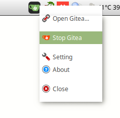
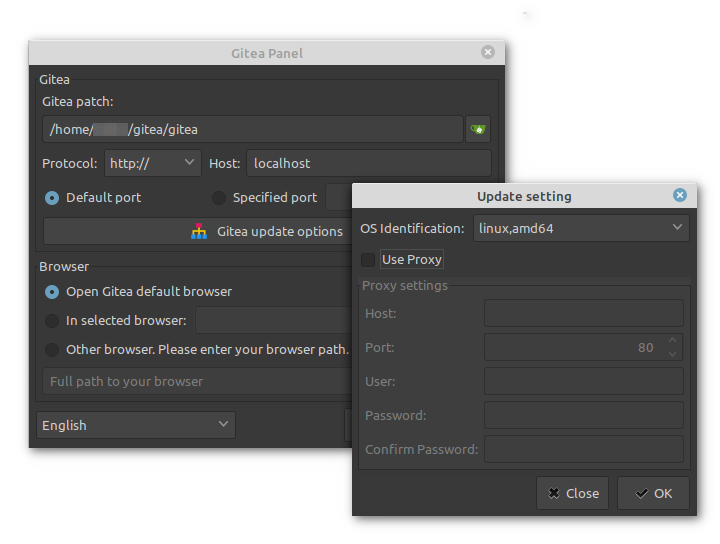
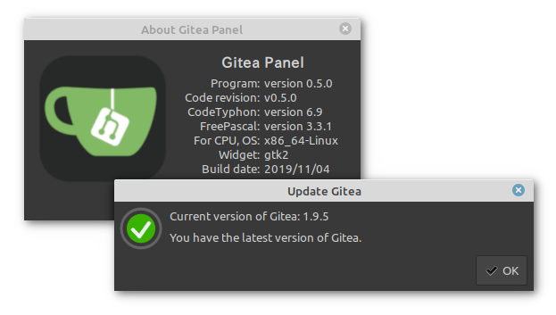

# Gitea Panel

[![download]](https://github.com/sashaoli/GiteaPanel/releases/latest) [![release]](https://github.com/sashaoli/GiteaPanel/releases/latest) ![platform] ![appimage] [![MIT license][license]](./LICENSE.md) [![CodeTyphon][typhon]](https://www.pilotlogic.com/sitejoom/)

*Swith to [English](./README_EN.md)*

### Управління локальним сервером Gitea з трею.







*Swith to [English](./README_EN.md)*

## Можливості.
- Графічний інтерфейс користувача.
- Запуск/Зупинка сервера Gitea.
- Відкриття сторінки Gitea у вибраному браузері.
- Оновлення Gitea до останньої версії.

## Залежності
- `openssl1.0`; *(libssl1.0.0)*
- `pgrep`; *(за замовчування присутній у системі)*
- `kill`; *(за замовчування присутній у системі)*

Встановити залежності SSL:
```bash
sudo apt-get install openssl1.0
```
або:
```bash
sudo apt-get install libssl1.0.0
```
У деяких випадках може знадобитися встановлення `libssl1.0-dev`
```Bash
sudo apt-get install libssl1.0-dev
```

##### AppImage:
Містить у собі необхідні бібліотеки SSL. Тому немає необхідності встановлювати їх у систему.</br> Містить тему "Adwaita" та застосовує її, до інтерфейсу програми, незалежно від теми системи.

## Встановлення.
1. Завантажте та встановіть програму з деб-пакунка та запустіть з головного меню Вашої системи. До прикладу:
    ```bash
    curl -L -O https://github.com/sashaoli/GiteaPanel/releases/download/v0.7.0/giteapanel_0.7.0_amd64.deb
    sudo dpkg -i giteapanel_0.7.0_amd64.deb
    ```
    Або, для запуску програми, використовуйте файл AppImage. До прикладу:
    ```bash
    curl -L -O https://github.com/sashaoli/GiteaPanel/releases/download/v0.7.0/giteapanel_0.7.0_x86_x64.AppImage
    chmod +x giteapanel_0.7.0_x86_x64.AppImage
    ```
    > Для оточення **"Gnome"** необхідно встановити розширення ["TopIcons"](https://extensions.gnome.org/extension/495/topicons/), або ["TopIcons Plus"](https://extensions.gnome.org/extension/1031/topicons/), або ["Tray Icons"](https://extensions.gnome.org/extension/1503/tray-icons/).

2.  Вкажіть, у полі "Gitea path", шлях до бінарного файлу сервера Gitea. Бажано, щоб назва файлу була "gitea".
3.  Натисніть кнопку "Gitea update options" та у полі "OS Idettification" вкажіть Вашу операційну систему.
4.  За необхідності змініть мову програми.

## Використання.
Управління програмою здійснюється з трею при кліку правою кнопкою мишки.</br>Подвійний клік на іконці в трею запускає сервер Gitea та відкриває сторінку Gitea в браузері.

## Переклад.
На даний момент програма підтримує такі мови:

| Мова       | код  |
| ---------- | ---- |
| Білоруська | `be` |
| Германська | `de` |
| Англійська | `en` |
| Польська   | `pl` |
| Російська  | `ru` |
| Українська | `uk` |

*У перекладі можуть міститися помилки, оскільки він здійснений за допомогою машинного перекладача.*

Якщо, Ви, **знайшли помилку у перекладі програми - будь-ласка повідомте про неї**, вказавши код мови перекладу, оригінальний текст англійською та правильний текст перекладу. До прикладу:

| код мови | оригінальний текст англійською           | правильний текст перекладу          |
| -------- | ---------------------------------------- | ----------------------------------- |
| `pl`     | `Checking for a new version of Gitea...` | `Sprawdzanie nowej wersji Gitea...` |

[download]: https://img.shields.io/github/downloads/sashaoli/GiteaPanel/total?style=flat
[release]:  https://img.shields.io/github/v/release/sashaoli/Giteapanel?style=flat
[platform]: https://img.shields.io/badge/platform-linux--64%20%7C%20linux--32-red
[appimage]: https://img.shields.io/badge/AppImage-x86__x64%20%7C%20i386-9cf
[license]:  http://img.shields.io/badge/license-MIT-brightgreen.svg
[typhon]:   https://img.shields.io/badge/CodeTyphon-7.20-green.svg
