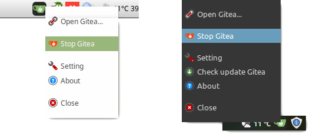

# Gitea Panel

#### `[en]`Manage the local Gitea server from the tray.
#### `[uk]`Управління локальним сервером Gitea з трею.

 

 

## `[en]`Features.`[uk]`Можливості.
- `[en]`Start/Stop Gitea server.
  `[uk]`Запуск/Зупинка сервера Gitea.
- `[en]`Opens the Gitea page in the selected browser.
  `[uk]`Відкриття сторінки Gitea у вибраному браузері.
- `[en]`Update Gitea to the latest version.
  `[uk]`Оновлення Gitea до останньої версії.

## `[en]`Install.`[uk]`Встановлення.
1.  `[en]`Download and Install the application from the deb package and launch from the main menu of your system.
    `[uk]`Завантажте та встановіть програму з деб-пакунка та запустіть з головного меню Вашої системи.
    ```
    curl -L -O https://github.com//atom/releases/download/v0.5.6/giteapanel_0.5.6_amd64.deb
    sudo dpkg -i giteapanel_0.5.6_amd64.deb
    ```
    `[en]`Or, to start the program, use the AppImage file.
    `[uk]`Або, для запуску програми, використовуйте файл AppImage.
    ```
    curl -L -O https://github.com//atom/releases/download/v0.5.6/giteapanel_0.5.6_x86_64.AppImage
    chmod +x giteapanel_0.5.6_x86_64.AppImage
    ```
    >`[en]`For environment ** "Gnome" ** must be installed extension ["TopIcons"](https://extensions.gnome.org/extension/495/topicons/), or ["TopIcons Plus"](https://extensions.gnome.org/extension/1031/topicons/), or ["Tray Icons"](https://extensions.gnome.org/extension/1503/tray-icons/). Also, similar extensions must be installed for others **"Unity"**.

    >`[uk]`Для оточення **"Gnome"** необхідно встановити розширення ["TopIcons"](https://extensions.gnome.org/extension/495/topicons/), або ["TopIcons Plus"](https://extensions.gnome.org/extension/1031/topicons/), або ["Tray Icons"](https://extensions.gnome.org/extension/1503/tray-icons/). Також, подібні розширення необхідно встановити для оточення **"Unity"**.
2.  `[en]`In the "Gitea path" field, specify the path to the binary file of the Gitea server. The file name is preferably "gitea".
    `[uk]`Вкажіть, у полі "Gitea path", шлях до бінарного файлу сервера Gitea. Бажано, щоб назва файлу була "gitea".
3.  `[en]`Click the "Gitea update options" button and in the "OS Idettification" field, specify your operating system.
    `[uk]`Натисніть кнопку "Gitea update options" та у полі "OS Idettification" вкажіть Вашу операційну систему.
4.  `[en]`Change the program language if necessary.
    `[uk]`За необхідності змініть мову програми.

## `[en]`Usage.`[uk]`Використання.
`[en]`The program is controlled from the tray by right-clicking. Double-clicking on the tray icon launches the Gitea server and opens the Gitea page in the browser.
`[uk]`Управління програмою здійснюється з трею при кліку правою кнопкою мишки. Подвійний клік на іконці в трею запускає сервер Gitea та відкриває сторінку Gitea в браузері.

## `[en]`Translate.`[uk]`Переклад.
`[en]`Currently the program supports three languages: Ukrainian, English, Russian.
`[uk]`На даний момент програма підтримує три мови: Українська, Англійська, Російська.
